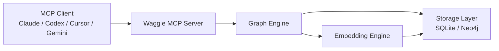
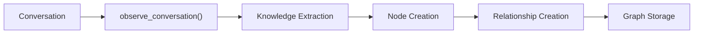
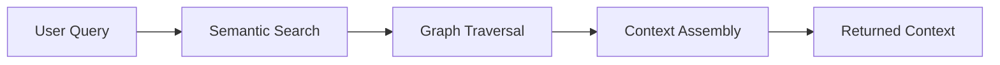
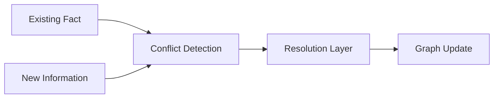
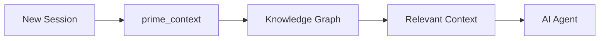
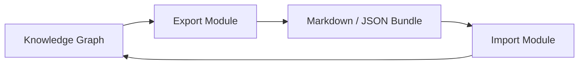
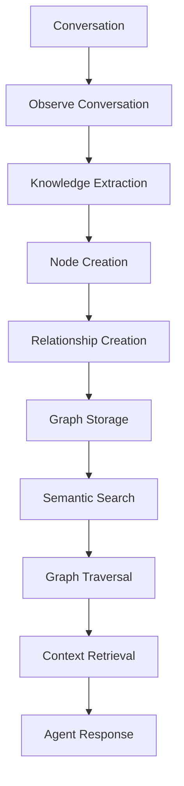

# Waggle MCP Architecture Guide

## Overview

Waggle MCP is a graph-backed conversational memory system designed for AI agents and MCP-compatible clients. Instead of relying on large context windows or traditional document retrieval, Waggle stores knowledge as a structured graph of facts, decisions, preferences, concepts, and relationships.

The goal of Waggle is to provide persistent, explainable, and queryable memory across multiple sessions while minimizing token consumption and preserving reasoning chains.

---

# System Architecture

---

## Component Responsibilities

### MCP Client Layer

This is the AI application that communicates with Waggle.

Examples include:

* Claude
* Codex
* Cursor
* Gemini CLI
* Antigravity
* ChatGPT-compatible MCP clients

Responsibilities:

* Send memory requests
* Query historical knowledge
* Store new information
* Prime context before answering users

---

### MCP Server Layer

The server acts as the communication bridge between clients and the memory graph.

Responsibilities:

* Receive MCP tool calls
* Validate requests
* Route commands
* Manage graph operations
* Return structured results

Examples of supported actions:

* observe_conversation
* query_graph
* graph_diff
* prime_context
* export_context_bundle

---

### Graph Engine

The Graph Engine is the core intelligence layer.

Responsibilities:

* Create nodes
* Create relationships
* Link related memories
* Resolve conflicts
* Perform graph traversal

Unlike traditional note storage, the graph stores relationships between concepts, making reasoning and retrieval more effective.

---

### Storage Layer

Waggle supports multiple storage backends.

#### SQLite

Recommended for:

* Individual developers
* Local installations
* Lightweight usage

Benefits:

* Zero setup
* Local-first
* Fast startup

#### Neo4j

Recommended for:

* Teams
* Shared memory systems
* Production deployments

Benefits:

* Scalability
* Advanced graph operations
* Multi-user support

---

### Embedding Engine

Embeddings enable semantic search.

Responsibilities:

* Convert text into vector representations
* Support similarity search
* Improve retrieval quality

Supported modes:

#### Transformer Embeddings

Examples:

* all-MiniLM-L6-v2
* all-mpnet-base-v2

Advantages:

* Better semantic understanding
* Higher retrieval quality

#### Deterministic Mode

Advantages:

* Fully offline
* No model download required
* Reproducible outputs

---

# Memory Ingestion Workflow

The ingestion pipeline converts conversations into structured graph knowledge.

---

## Step 1: Conversation Input

A user interacts with an AI agent.

Example:

"We decided to use PostgreSQL because MySQL replication became difficult to maintain."

---

## Step 2: Knowledge Extraction

Waggle identifies:

* Decisions
* Facts
* Preferences
* Concepts
* Reasons

---

## Step 3: Node Generation

Generated nodes:

Decision:
Use PostgreSQL

Reason:
MySQL replication became difficult

---

## Step 4: Edge Creation

Relationship generated:

Decision
→ depends_on
→ Reason

This creates connected memory rather than isolated notes.

---

# Knowledge Graph Model

## Node Types

### Fact

Stores objective information.

Example:

"The project uses PostgreSQL."

---

### Entity

Represents people, systems, tools, or objects.

Example:

PostgreSQL

---

### Concept

Represents abstract ideas.

Example:

Database Replication

---

### Preference

Stores user or team preferences.

Example:

Dark Mode Preferred

---

### Decision

Captures important choices.

Example:

Use PostgreSQL

---

### Question

Represents unresolved discussions.

Example:

Should we migrate to Neo4j?

---

### Note

General observations and reminders.

Example:

Add integration testing

---

# Relationship Types

## relates_to

General connection between nodes.

---

## depends_on

Indicates reasoning dependency.

Example:

Decision → depends_on → Reason

---

## contradicts

Represents conflicting information.

---

## updates

Represents newer information replacing older context.

---

## derived_from

Shows information lineage.

---

## similar_to

Connects semantically related concepts.

---

## part_of

Represents membership or hierarchy.

---

# Retrieval Workflow

When a user asks a question, Waggle retrieves relevant graph context.

---

## Retrieval Stages

### Semantic Search

Identify relevant graph nodes.

### Graph Traversal

Explore connected relationships.

### Context Assembly

Collect:

* Facts
* Decisions
* Reasons
* Contradictions
* Updates

### Result Delivery

Return optimized context to the AI agent.

---

# Conflict Resolution Workflow

Knowledge changes over time.

Waggle preserves history rather than deleting information.

---

## Example

Original:

"We use PostgreSQL."

Later:

"We are switching back to MySQL."

Instead of deleting the first fact:

* Old decision remains
* The new decision is stored
* Contradiction becomes explicit

Benefits:

* Historical traceability
* Better reasoning
* Auditability

---

# Context Priming Workflow

Before answering questions, clients may request context.

This enables continuity across sessions.

---

# Export and Import Architecture

Waggle supports portable memory exchange.

---

## Supported Exports

### Context Bundle

Portable AI memory package.

### Markdown Vault

Obsidian-compatible knowledge vault.

### Graph Backup

Full graph preservation.

---

# Data Flow Summary

---

# Contributor Onboarding

## Recommended Learning Path

1. Understand the Graph Model
2. Learn Node Types
3. Learn Relationship Types
4. Study Ingestion Workflow
5. Study Retrieval Workflow
6. Explore Export and Import Features
7. Review Conflict Resolution

---

# Development Philosophy

Waggle follows several core principles:

### Graph First

Relationships matter as much as facts.

### Local First

Works offline using SQLite.

### Explainable Memory

Reasoning chains remain visible.

### Persistent Context

Knowledge survives across sessions.

### Portable Knowledge

Memory can be exported and shared.

---

# Conclusion

Waggle transforms conversational history into a structured knowledge graph that enables long-term memory, efficient retrieval, conflict-aware reasoning, and persistent context across AI sessions.

By combining graph relationships, semantic embeddings, and MCP compatibility, Waggle provides a scalable memory layer for modern AI agents.
