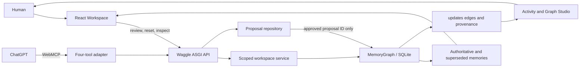

# Waggle WebMCP Devpost Submission Package

This document is the paste-ready source of truth for the challenge submission.
Do not describe the real ChatGPT acceptance run or YouTube video as complete
until those gates are recorded in `WEBMCP_STATUS.md` and independently checked.

## Project identity

**Project name:** Waggle WebMCP  
**Tagline:** Shared project memory, governed by humans.  
**Closing line:** Waggle — humans govern what agents remember.

**One-line thesis**

Waggle gives ChatGPT a shared project memory that agents can read and propose
changes to, while humans control the exact truth that becomes authoritative.

**Short description**

Waggle WebMCP makes agent memory visible and governable: ChatGPT recalls real
project context, proposes corrections, and applies only the exact payload a
human approved.

## Main submission copy

### The problem

AI agents increasingly rely on persistent memory, but that memory is usually
opaque to the people affected by it. A user may not know which decision the
agent considers authoritative, why it changed, or whether an old answer is
still influencing retrieval. Worse, an agent that can silently rewrite its own
memory collapses suggestion and authority into the same action.

Project memory needs a visible human boundary. People should be able to inspect
what an agent knows, review proposed corrections, preserve history, and decide
the exact wording that becomes the new shared truth.

### What Waggle does

Waggle WebMCP connects ChatGPT to a governed project-memory workspace. ChatGPT
and the human operate on the same isolated graph state:

1. ChatGPT requests a structured project brief from Waggle.
2. It recalls only the current authoritative memories for a question.
3. If a memory conflicts with a project constraint, the agent proposes a
   replacement without modifying the authoritative value.
4. A human rejects, approves, or edits and approves the proposal in Waggle.
5. ChatGPT can then apply only that approved proposal ID; it cannot supply new
   replacement text or bypass review.
6. Waggle creates a new authoritative memory, preserves the previous value as
   superseded, records an `updates` edge, and retains proposal, reviewer,
   evidence, timestamp, and activity provenance.
7. A second recall returns the exact human-approved truth.

The Workspace makes Current Context, Key Decisions, Recent Memories, Pending
Human Review, and a live Memory Map visible immediately. A six-step Guided Demo
orchestrates the complete story using real WebMCP events and human actions.
Graph Studio then exposes the resulting lineage in the same browser-isolated
judge session.

### Why WebMCP matters

WebMCP makes the website an active participant in the ChatGPT interaction
rather than a passive dashboard beside it. Waggle registers four purpose-built
tools directly from the visible Workspace. The model can retrieve the same
memory the human is viewing, and successful invocations update the guide and
activity trail in real time.

That shared surface is especially valuable for governance. The agent proposes
through WebMCP, the human reviews through the website, and the agent applies
through WebMCP only after approval. Each side has a distinct capability, and
the transition between them is visible and auditable.

### The four WebMCP tools

- `get_project_brief(project_id)` returns the authoritative project goal,
  decisions, constraints, current state, open questions, recent changes, and
  supporting memory IDs.
- `recall_memory(project_id, query, limit?)` uses Waggle's scoped graph
  retrieval and returns current authoritative memories while excluding
  superseded and expired values.
- `propose_memory_change(project_id, memory_id, proposed_content, reason?,
  evidence_ids?)` creates an idempotent pending proposal and leaves
  authoritative memory unchanged.
- `apply_approved_memory_change(proposal_id)` applies exactly what a human
  approved. It cannot provide or alter the replacement content.

### Governance and safety

Every proposal fingerprints the target memory version. If that target changes
before review or application, Waggle marks the proposal stale instead of
overwriting newer truth. Approval freezes the exact human-reviewed payload, and
application is idempotent. The old memory remains available as superseded
history while ordinary recall returns only the current authority.

The hosted challenge mode is seeded and isolated. An opaque
`HttpOnly; Secure; SameSite=None` cookie maps each browser to a separate tenant
and physical project namespace. The backend accepts credentialed requests only
from the exact frontend origin, and Reset Demo clears and reseeds only the
current browser's workspace.

### Technical architecture



The frontend is a Vite/React static deployment. Its WebMCP adapter registers
the browser tools and calls the existing Python ASGI application. The backend
uses Waggle's deterministic embedding mode and SQLite graph backend for the
hosted challenge fixture. Proposal state is stored separately from
authoritative memory until approved application atomically creates native graph
lineage and audit provenance.

The production Waggle architecture remains local-first by default: SQLite and
local embeddings run on the user's machine, with Neo4j optional. The hosted
Render challenge instance is intentionally different—a zero-setup,
browser-isolated demonstration using ephemeral SQLite.

### What was built during the challenge

The pre-existing Waggle project already included Waggle Core, `MemoryGraph`,
graph and hybrid retrieval, the MCP server, local SQLite storage, optional
Neo4j support, provenance/evidence records, and the Graph Studio foundation.

Challenge development begins at commit `159f66f` and adds:

- the browser WebMCP adapter and four registered tools;
- structured project briefs and authoritative-only recall;
- a durable proposal repository and human review lifecycle;
- immutable approved payloads, stale-target protection, and idempotent apply;
- native authoritative/superseded lineage plus proposal and reviewer provenance;
- the governed Workspace and complete activity trail;
- browser-isolated seeded judge mode and session-scoped reset;
- the six-step real-event Guided Demo and focused Graph Studio lineage;
- the split hosted frontend/backend deployment and public acceptance run.

This boundary is documented in the repository README and preserved in the
challenge branch's commit history. No pre-existing Waggle capability is claimed
as new challenge work.

### Challenges

The hardest part was enforcing a real governance boundary without building a
parallel memory system. Proposals had to remain durable but non-authoritative;
human-edited text had to become immutable after approval; and application had
to fail safely if the target changed meanwhile. The solution uses target
fingerprints, an explicit proposal lifecycle, and an apply operation that
accepts only the proposal ID.

The hosted judge experience added a second challenge: zero-setup access without
authentication or shared demo state. Browser sessions therefore map to
isolated tenant and project namespaces while the public WebMCP project alias
remains stable. Reset, proposals, activity, and graph data all stay within that
session boundary.

Finally, the Guided Demo could not fake progress. It uses a persisted state
machine that advances only from successful registered-tool callbacks and the
real human approval response. Normal navigation and reload preserve progress
without storing authoritative truth on the client.

### Accomplishments

- A judge can understand the shared-memory and human-governance model from the
  first Workspace viewport.
- The full brief → recall → propose → human edit and approval → apply → corrected
  recall sequence uses the same memory graph throughout.
- The agent cannot directly overwrite authoritative memory or mutate an
  approved payload.
- Activity and Graph Studio preserve the complete supersession and provenance
  chain.
- Independent public sessions, cross-session mutation rejection, scoped reset,
  exact-origin CORS, secure cookies, routes, health endpoints, and the complete
  public API flow were validated on the hosted deployment.

### What we learned

Human control is strongest when it is expressed as a capability boundary, not
just explanatory UI. Separating “propose” from “apply,” freezing the reviewed
payload, and making apply accept only an identifier turns governance into a
property of the system rather than a promise made by the agent.

We also learned that provenance becomes far more understandable when Workspace
and Graph Studio show the same state at different levels: one supports the
human decision, while the other explains the lineage after the decision.

### What's next

The challenge version is deliberately focused. After submission, potential
follow-ups include deeper evidence inspection and smoother focused-lineage
transitions. Authentication, billing, device sync, a new retrieval stack, and
multi-tenant SaaS infrastructure are intentionally outside this submission.

## Links

- **Live Workspace:** https://waggle-webmcp.onrender.com/
- **Graph Studio:** https://waggle-webmcp.onrender.com/graph
- **Public repository:** https://github.com/Abhigyan-Shekhar/Waggle-mcp
- **Challenge branch:** https://github.com/Abhigyan-Shekhar/Waggle-mcp/tree/codex/waggle-webmcp
- **Open-source license:** https://github.com/Abhigyan-Shekhar/Waggle-mcp/blob/codex/waggle-webmcp/LICENSE
- **Demo video:** add the final public YouTube URL only after no-login playback,
  audio, text readability, and duration are verified.

## Judge instructions

Open the Live Workspace, select **See Waggle in Action**, and use its Copy
Prompt controls with ChatGPT. The public project ID is `waggle-webmcp`.

```text
Catch me up on this project using Waggle.
What did we decide about the storage architecture?
That conflicts with our local-first requirement. Propose a better memory, but don't change anything directly.
Apply the memory change I approved.
What storage architecture did we decide on?
```

At the human-review step, edit the proposal to:

```text
Use SQLite by default; Neo4j remains optional.
```

Then inspect Activity and follow **Explore lineage in Graph Studio**.

## Hosted demo limitations

- Render's free backend may take 50 seconds or more to wake after inactivity.
  The Workspace presents a connecting state during that interval.
- Free Render storage is ephemeral. A restart or redeploy may discard session
  data; the deterministic fixture is recreated on the next request.
- The hosted instance demonstrates an isolated judge workflow. It does not
  claim that Render itself is local-first storage.
- The final submission must not claim real ChatGPT acceptance until all four
  tools are discovered and the complete flow passes there at least twice.

## Asset capture checklist

Store final submission media under `docs/assets/webmcp-submission/`. Capture
from the public deployment after warming the backend, using a clean browser at
100% zoom. Prefer 1600×900 PNG for landscape images; crop only when the primary
text remains readable. Never expose session cookies, private account details,
local filesystem paths, secrets, developer errors, or unrelated tabs.

### Required assets

| Filename | Capture state | Caption / proof |
|---|---|---|
| `01-waggle-webmcp-cover.png` | Workspace hero with Challenge Demo, Human controlled, thesis, Current Context, Key Decisions, and live Memory Map visible. | “Shared project memory, governed by humans.” |
| `02-workspace-guided-demo.png` | Guided Demo active after authoritative storage recall, with the real memory highlighted. | “ChatGPT reads the same authoritative memory the human sees.” |
| `03-proposal-human-governance.png` | Proposal comparison after **Edit & Approve**, showing previous content, frozen approved content, reviewer state, and Apply prompt. | “Agents propose; humans approve the exact payload.” |
| `04-graph-studio-lineage.png` | Focused Graph Studio after application, showing previous and new authoritative memories, the real `updates` edge, and Show full graph. | “Every correction preserves supersession and provenance.” |
| `05-webmcp-architecture.png` | Export the Technical architecture Mermaid diagram on a clean warm background with legible labels. | “ChatGPT and the human meet at one governed memory boundary.” |

### Optional supporting assets

| Filename | Capture state | Use |
|---|---|---|
| `06-activity-provenance.png` | Activity route showing brief, recall, proposal, approval, application, and corrected recall. | Technical proof or long-form gallery image. |
| `07-webmcp-registration.png` | Focused code capture from `apps/mcp/graph-ui/src/lib/webmcp.js`, including `modelContext.registerTool` and the four tool names without editor chrome containing private paths. | Code/implementation proof. |
| `08-guided-demo-complete.png` | Completed guide beside the corrected authoritative storage memory. | Closing or social image. |

Existing `apps/mcp/graph-ui/design-qa-assets/` images document design review but
should not be submitted as final gallery assets: their dimensions and
side-by-side comparison framing were optimized for QA rather than Devpost.

### Asset quality gate

- [ ] Every screenshot comes from the live current challenge deployment.
- [ ] Workspace and Graph Studio screenshots use the same isolated session.
- [ ] No screenshot uses mocked nodes, proposals, tool results, or lineage.
- [ ] Text remains readable in the Devpost gallery preview.
- [ ] The warm off-white, forest-green, serif-headline identity is consistent.
- [ ] Each image proves one claim and has a concise caption.
- [ ] The cover image communicates the product within five seconds.
- [ ] The architecture image exports cleanly without clipped Mermaid labels.
- [ ] Proposal and graph captures show the exact human-approved SQLite value.
- [ ] Images contain no private data, cookies, secrets, debug output, or local paths.
- [ ] Alt text is added for every uploaded image.

## Final submission gate

- [ ] Real ChatGPT discovers all four WebMCP tools.
- [ ] The complete human + agent flow passes at least twice after reset.
- [ ] `WEBMCP_STATUS.md` records the ChatGPT surface and acceptance result.
- [ ] The under-three-minute video follows `docs/webmcp-demo-video-script.md`.
- [ ] YouTube playback works publicly without login and includes clear audio.
- [ ] All five required assets pass the quality gate.
- [ ] Live, Graph Studio, repository, branch, license, and video URLs are correct.
- [ ] Claims about local-first Waggle and hosted ephemeral judge mode remain distinct.
- [ ] Challenge work is separated from pre-existing Waggle work.
- [ ] Every pasted Devpost field is proofread after formatting.
- [ ] The deployment is frozen once the final version is submitted.
